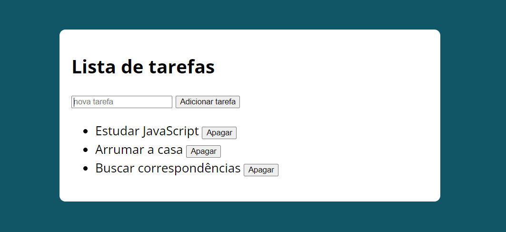
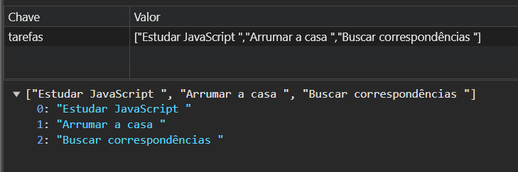

# Lista de Tarefas

Esta é uma demonstração de uma lista de tarefas, produzida com HTML, CSS e JavaScript para fins de estudo.

## Conteúdos Aplicados

### HTML

- Estrutura semântica de tags

### CSS

- Conceito e aplicação de BoxModel

### JavaScript

- Lógica de programação
- Funções - Programação Funcional
- LocalStorage
- Eventos
- JSON
- Manipulação do DOM

### Deployment

- Deploy no Netlify para hospedagem e disponibilização online

## Demonstração

Clique [aqui](https://listatarefas-js.netlify.app) para acessar a página online ou veja as capturas de tela abaixo.

### Tarefas

### Local Storage

